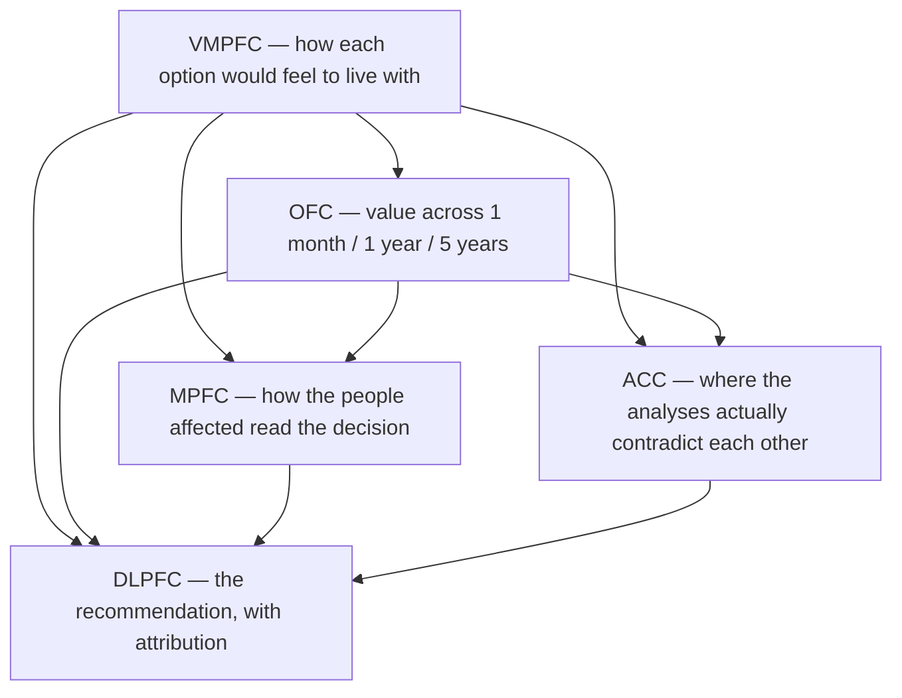

# SCAN

[](https://doi.org/10.5281/zenodo.14052884)


SCAN (Synthetic Cognitive Augmentation Network) is a multi-agent system that models prefrontal
cortex function to help you think through a decision. Five agents, each standing for a different
PFC region, analyse your topic from a different angle; a sixth step integrates them into a single
recommendation.

Requires **Python 3.10–3.12** and an OpenAI API key.

## Table of Contents

- [How it works](#how-it-works)
- [Quick start](#quick-start)
- [Usage](#usage)
- [Example output](#example-output)
- [Configuration](#configuration)
- [Troubleshooting](#troubleshooting)
- [Development](#development)
- [Tech stack](#tech-stack)
- [Contributing](#contributing)
- [Citation](#citation)
- [Changelog](#changelog)
- [License](#license)
- [Acknowledgements](#acknowledgements)

## How it works

Each region is asked for the kind of reasoning it actually does, and the later ones are given the
earlier analyses as context:



They run in that order, and the report leads with the DLPFC recommendation.

> **Cost and time.** A run makes five sequential model calls, each up to `MAX_TOKENS` (4000 by
> default), and takes a few minutes. Use `--dry-run` to see exactly what would be sent without
> spending anything, and `--model gpt-4o-mini` to try it cheaply.

## Quick start

```bash
git clone https://github.com/iLevyTate/SCAN.git
cd SCAN
uv sync --frozen
echo "OPENAI_API_KEY=your_key_here" > .env
uv run run-scan
```

Install uv via the [official instructions](https://docs.astral.sh/uv/getting-started/installation/).

## Usage

`run-scan` with no arguments prompts for a topic, as it always has. Everything else is optional:

```bash
run-scan                                   # interactive
run-scan "whether to take the new job"     # non-interactive
run-scan "..." --output report.md          # save the report
run-scan "..." --model gpt-4o-mini         # cheaper run
run-scan "..." --model DLPFC=gpt-4o --model gpt-4o-mini   # per-region models
run-scan "..." --dry-run                   # show the prompts, make no API calls
python -m scan --help                      # same CLI, module form
```

The report goes to **stdout** and everything else — banner, progress, errors — goes to
**stderr**, so `run-scan "..." > report.md` gives you a clean document.

| Exit code | Meaning |
| --- | --- |
| `0` | Success |
| `1` | Unexpected error |
| `2` | No topic supplied |
| `3` | Misconfigured (bad or missing setting) |
| `4` | The model provider failed |
| `130` | Interrupted |

If a run fails part-way through, the analyses that already completed are still written out, with
an "Incomplete report" banner in the document itself.

## Example output

```markdown
# SCAN report: whether to take the new job

## Recommendation (DLPFC)

**Recommendation** Take the job, but negotiate the start date out by three weeks.
**Why** The OFC's ranking only favours staying on the one-month horizon...

## How we got here

### Emotional analysis (VMPFC)

**Stakes** What is actually at risk here is not income but...

### Reward evaluation (OFC)
...
### Conflict resolution (ACC)
...
### Social insights (MPFC)
...
```

## Configuration

Create a `.env` file in the project root. `OPENAI_API_KEY` is the only required variable; see
[`example.env`](example.env) for the full list. Real environment variables take precedence over
`.env`.

| Variable | Default | Purpose |
| --- | --- | --- |
| `OPENAI_API_KEY` | — | **Required.** OpenAI credentials. |
| `SERPAPI_API_KEY` | unset | Enables the search tool. This is a **SerpAPI** (serpapi.com) key — serper.dev is a different service and its keys will not work. The legacy name `SERPER_API_KEY` is still accepted. |
| `DLPFC_MODEL`, `VMPFC_MODEL`, `OFC_MODEL`, `ACC_MODEL`, `MPFC_MODEL` | `gpt-4o` | Model per region. |
| `MAX_TOKENS` | `4000` | Maximum tokens per response. |
| `REQUEST_TIMEOUT` | `180` | Per-request timeout in seconds. Bounds a hung connection, not the whole run. |
| `LOG_LEVEL` | `WARNING` | `DEBUG`, `INFO`, `WARNING`, `ERROR` or `CRITICAL`. |
| `DISABLE_TELEMETRY` | `true` | crewai ships anonymous traces to `telemetry.crewai.com`; disabled by default. |

Unrecognised variables in `.env` are ignored, so SCAN can share a `.env` with other tools.

## Troubleshooting

| Symptom | Cause |
| --- | --- |
| Exit 3, "The environment variable 'OPENAI_API_KEY' is missing" | No key in `.env` or the environment. |
| Exit 3, "was rejected by the provider" | A `*_MODEL` value is misspelled or your account lacks access. The message names which setting. |
| Exit 4, "did not respond within REQUEST_TIMEOUT" | Slow or hung connection. Raise it with `--timeout`. |
| The search tool never runs | `SERPAPI_API_KEY` is unset. SCAN logs this at `INFO`, so run with `--log-level INFO` to see it. |
| Want to see what will be sent | `--dry-run` prints the resolved config and all five prompts, and makes no API calls. |
| Need more detail | `--log-level DEBUG`. Third-party libraries stay at `WARNING` so the output stays readable. |

## Development

```bash
uv sync --locked          # install, asserting the lockfile matches pyproject.toml
uv run pre-commit install # optional but recommended
uv run pytest             # tests, with coverage (must stay >= 95%)
```

The same gates CI runs:

```bash
uv run ruff format scan tests --check
uv run ruff check scan tests --no-fix
uv run mypy scan tests
uv run pytest
```

Note that `pre-commit` blocks direct commits to `main` — work on a branch.

To add a sixth region, add one `PFCRole` to [`scan/roles.py`](scan/roles.py) and its `*_MODEL`
field to `Settings` in [`scan/config.py`](scan/config.py). Everything else — the agent, the task,
the dependency wiring, the report section — derives from that table, and a test fails if the two
fall out of step.

## Tech stack

- **CrewAI** — agent and task orchestration, and (via litellm) the actual model calls
- **LangChain** — supplies the SerpAPI wrapper and the `Tool` interface for web search
- **Rich** — terminal output
- **Pydantic / pydantic-settings** — configuration and validation

Dependencies are pinned exactly. This is a citable research artefact, so reproducibility is worth
more here than staying current.

## Contributing

Issues and pull requests are welcome. For anything substantial, please open an issue first to
discuss it. See [CONTRIBUTING.md](CONTRIBUTING.md) for the development workflow, and
[SECURITY.md](SECURITY.md) for reporting vulnerabilities.

## Citation

If you use SCAN in published work, please cite it via the DOI badge above or the metadata in
[CITATION.cff](CITATION.cff). The badge resolves to the most recent release; each release also
has its own version DOI if you need to cite a specific one.

The SCAN paper cites `1.0.0-alpha`
([10.5281/zenodo.14052885](https://doi.org/10.5281/zenodo.14052885)). Note that the five agents
did not execute their own tasks in that version — see the
[changelog](CHANGELOG.md#100---2026-08-06). Work reproducing the paper's architecture should use
1.0.0 or later.

## Changelog

See [CHANGELOG.md](CHANGELOG.md).

## License

MIT — see [LICENSE](LICENSE).

## Acknowledgements

- **CrewAI**, for the agent orchestration framework
- **LangChain**, for the tool integrations
- **OpenAI**, for the language models
- Everyone who has contributed to SCAN
